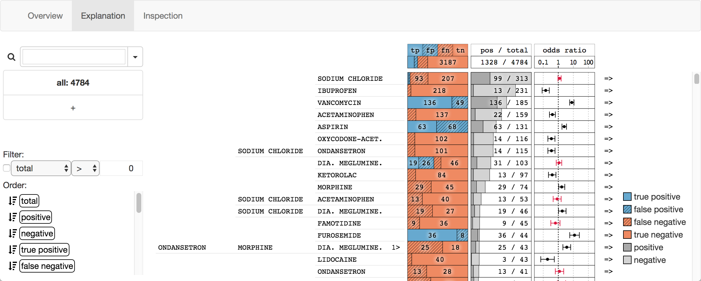

# Explainer

Explainer is a visual interface to explore similarly explained data items.
Having a trained machine learning model it is possible to create explanations for
data items by probing model inputs.
The visual analytics interface groups similar explanations together and provides
an interactive way of exploring the significants and quantity of those explanations
in a given data set, i.e., a validation data set.



## Publications

[A Workflow for Visual Diagnostics of Binary Classifiers using Instance-Level Explanations](https://arxiv.org/abs/1705.01968);
Josua Krause, Aritra Dasgupta, Jordan Swartz, Yindalon Aphinyanaphongs, Enrico Bertini;
To be published at IEEE VAST 2017.

## Getting started

The project consists of a `python` server with a web front-end.
To get started clone the repository and run:

```bash
git submodule update --init --recursive
pip install -r requirements.txt
```

After that the project is ready to run.

```bash
./server.py input.csv expl.json
```

where `input.csv` and `expl.json` are files as described [below](#input-format)
or as created with [`create_explanations.py`](#creating-explanations).
Once the server is started navigate to the URL as prompted in the server output.

Run `./server.py -h` to get a list of all input arguments.

## Creating explanations

In order to create explanations you can implement a subclass of the `Model`
class in `defs.py`. Then you can call `create_explanations.py` with:

```bash
./create_explanations.py yourfile YourModel output
```

where `yourfile` is a relative python module path (ie., `yourfile.py` is a
file in the current folder) which contains the definition of `YourModel` which
is a subclass of `defs.Model`. `output` is the folder where the two output
files (the input to `./server.py`) are written to.

`./create_explanations.py` uses the [LIME algorithm](https://arxiv.org/abs/1602.04938) by default.

`example.py` contains an example implementation for a categorical dataset
(whether mushrooms are edible given certain physical features)
and can be used like this:

```bash
./create_explanations.py example ExampleModel output
```

And the server can then be started via:

```bash
./server.py output/examplemodel.csv output/examplemodel.lime.json
```

## Input format

As of now the project requires two input files.
The input data and the explanation description.

The input data has to be a CSV file representing a binary data matrix.
The first row contains the column names.
There is one special columns
`label` (containing the ground truth label `0` or `1`) and
the file should only contain rows of the validation data set.

The explanation description is a JSON file of the following format:

```javascript
{
  "test_auc": 0.85, // area under ROC curve for the explained set
  "train_auc": 0.9, // area under ROC curve for the training set
  "total_rows": 135, // number of rows in the input data that belong to the explained set (used for integrity check)
  "total_true": 71, // number of rows with a `1` label in the input data that belong to the explained set (used for integrity check)
  "threshold": 0.6, // the optimal threshold minimizing incorrectly predicted training instances
  "features": [ "foo", "bar", ... ], // names of the features corresponding to the input data
  "expls": [ // array of explanations for each data item in order of the ixs array
    {
      "ix": 0, // the index of the current item starting at 0
      "label": 0, // the ground truth label 0 or 1
      "pred": 0.1, // prediction score
      "pred_label": 0, // the predicted label 0 or 1 using the threshold from above (used for integrity check)
      "expl": [ // the explanation
        [ 12, "+" ], // one step: feature index in features array, feature prefix (can be "")
        // ...
      ],
      "postfixes": [ // postfixes to put after feature names -- corresponds to the features array
        "=[0, 10)",
        "=5",
        "", // empty string if no postfix should be added
        None, // ignore feature when listing
        // ...
      ],
    },
    // ...
  ],
}
```

### Older formats

Using `--protocol 0` as additional command line argument enables using the legacy
format.
Here, the CSV file has an additional column
`pred` (containing the prediction score of the current row between `0.0` and `1.0`).
Also, ideally, the file should contain both rows of the training
data set (optional) and validation data set (needed).

The explanation description is a JSON file of the following format:

```javascript
{
  "auc": 0.85, // area under ROC curve for the explained set
  "train_auc": 0.9, // area under ROC curve for the training set
  "ixs": [ 0, 1, 2, ... ], // indices of rows in the input data that belong to the explained set
  "train_ixs": [ 135, 136, 137, ... ], // indices of rows in the input data that belong to the training set
  "total_features": 1400, // number of features (used for integrity check)
  "total_rows": 135, // number of rows in the input data that belong to the explained set (used for integrity check)
  "total_true": 71, // number of rows with a `1` label in the input data that belong to the explained set (used for integrity check)
  "train_preds": [ 0.2, 0.113, ... ], // prediction scores for training data in order of the train_ixs array
  "features": [ "foo", "bar", ... ], // names of the features corresponding to the input data
  "expls": [ // array of explanations for each data item in order of the ixs array
    {
      "file": null, // unused
      "meta": "", // unused
      "ix": 0, // the index of the current item (must correspond to the ixs array)
      "label": 0, // the ground truth label 0 or 1
      "pred": 0.1, // prediction score
      "down": [ // removing features (aka. setting features to 0) to reduce the prediction score
        [ 12, 0.09, [] ], // one step: feature index in features array, new prediction score, re-addable feature list
        // ...
      ],
      "up": [ // removing features to increase the prediction score
        [ 24, 0.11, [] ], // one step: feature index in features array, new prediction score, re-addable feature list
        // ...
      ],
    },
    // ...
  ],
}
```
